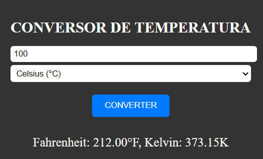

# CONVERSOR DE TEMPERATURA
🆎CONVERSOR DE TEMPERATURA EM HTML, CSS E JS.

  

## DESCRIÇÃO:
Este projeto consiste em um conversor de temperatura que permite aos usuários converter entre Celsius (°C), Fahrenheit (°F) e Kelvin (K). Aqui estão as principais funcionalidades implementadas:

1. Inserir Temperatura e Selecionar Unidade:
   - Os usuários podem inserir a temperatura desejada no campo "Digite a temperatura" e selecionar a unidade de origem da lista suspensa.

2. Converter:
   - Ao clicar no botão "CONVERTER", o sistema realizará a conversão da temperatura para as outras duas unidades selecionadas e exibirá o resultado abaixo.

## EXECUTANDO O PROJETO:
1. Inserir Temperatura:
   - Digite a temperatura que deseja converter no campo "Digite a temperatura".
   - Selecione a unidade de temperatura de origem (Celsius, Fahrenheit ou Kelvin) no menu suspenso.

2. Converter:
   - Clique no botão "CONVERTER" para realizar a conversão da temperatura inserida.
   - O resultado da conversão será exibido abaixo do botão, mostrando os valores convertidos para as outras duas unidades de temperatura.
   
## NÃO SABE?
- Entendemos que para manipular arquivos em `HTML`, `CSS` e outras linguagens relacionadas, é necessário possuir conhecimento nessas áreas. Para auxiliar nesse aprendizado, oferecemos cursos gratuitos disponíveis:
* [CURSO DE HTML E CSS](https://github.com/VILHALVA/CURSO-DE-HTML-E-CSS)
* [CURSO DE JAVASCRIPT](https://github.com/VILHALVA/CURSO-DE-JAVASCRIPT)
* [CONFIRA MAIS CURSOS](https://github.com/VILHALVA?tab=repositories&q=+topic:CURSO)

## CREDITOS:
- [PROJETO CRIADO PELO VILHALVA](https://github.com/VILHALVA)
- [ESTÁ DISPONIVEL NO SITE](https://vilhalva.github.io/STYLER/STYLER.html)

